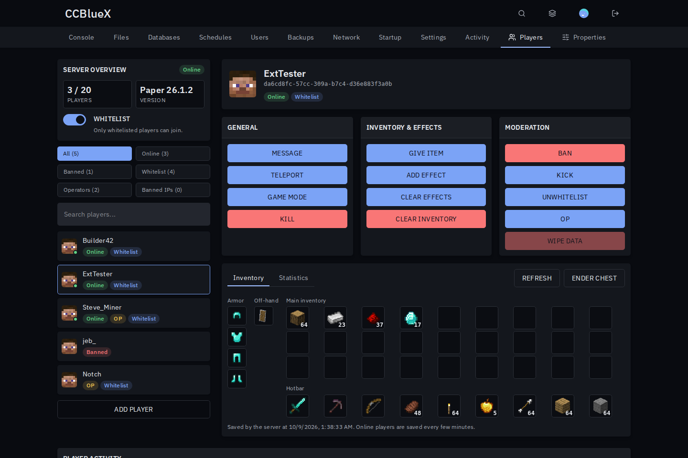
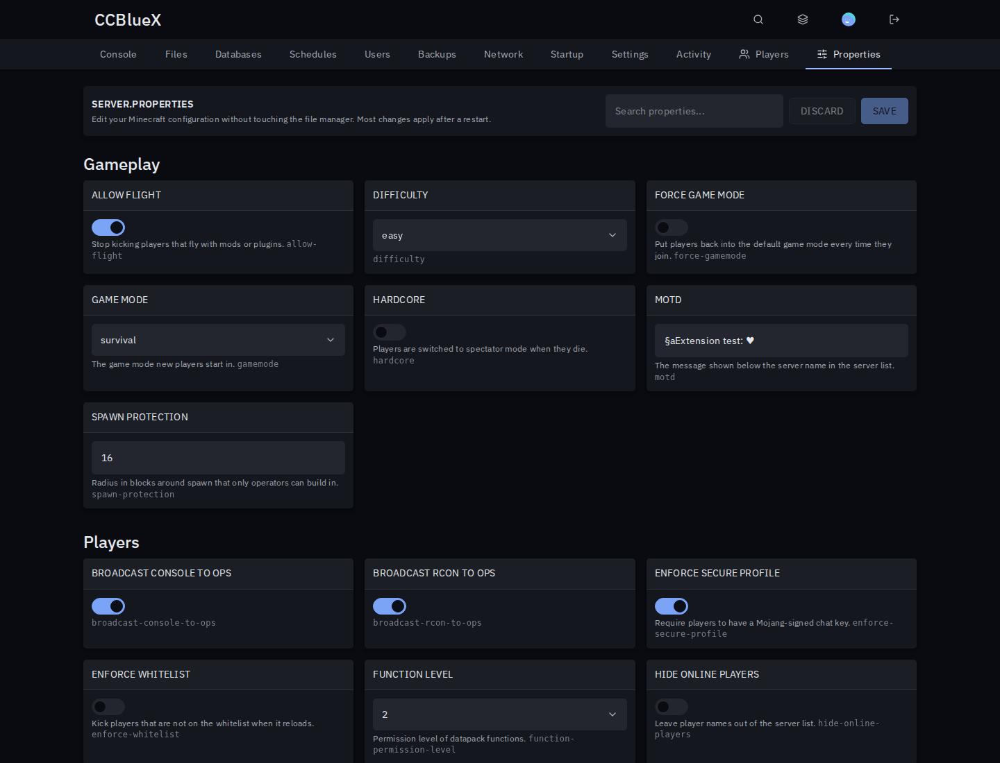
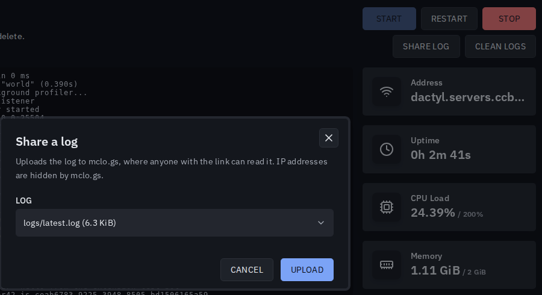

# Minecraft for Pterodactyl

Players, server.properties and logs of your Minecraft servers, right in the panel.

## Install

1. Download `minecraft-<version>.pteroext` from the [latest release](https://github.com/1zun4/Pterodactyl-Extension-Minecraft/releases/latest).
2. Open **Admin → Extensions**, click **Install** and pick the file.
3. Enable it and reload the panel.

The **Players** and **Properties** tabs show up on every server with a Minecraft egg.

## Features

- **Players**: online list, inventories, ender chests and statistics. Message, teleport, give items, kick, ban, whitelist and op in one click.
- **Properties**: every `server.properties` setting with the right control, search, save and restart.
- **Share log**: upload the console, `latest.log` or a crash report to [mclo.gs](https://mclo.gs).
- **Clean logs**: delete or archive old logs and crash reports, once or every day.
- **Player count**: live count on the dashboard and a weekly activity heatmap.

## Permissions

Subusers get a **Minecraft server tools** group in the server's **Users** tab: view or edit properties, view, manage or moderate players, share logs and clean logs.

## Settings

**Admin → Extensions → Minecraft**

| Setting | What it does |
| --- | --- |
| Player head URL | Where player heads come from. Default: mc-heads.net. |
| Item icon URLs | Where inventory icons come from, tried in order. |
| Query host | Host the panel uses to reach game servers, if the allocation address does not work from the panel. |
| mclo.gs API | Point it at a self-hosted mclo.gs. |

---

Inspired by the Pelican plugins Minecraft Server Config, Player Counter, Mclogs Uploader and McLogCleaner. Player heads and item icons are loaded from third-party sites; Minecraft is a trademark of Mojang.
